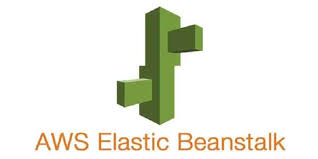
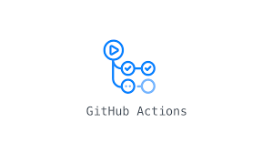
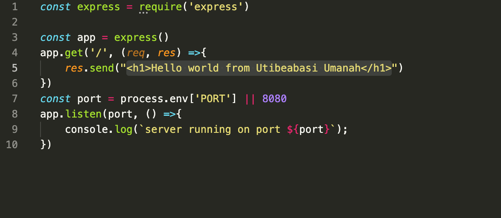
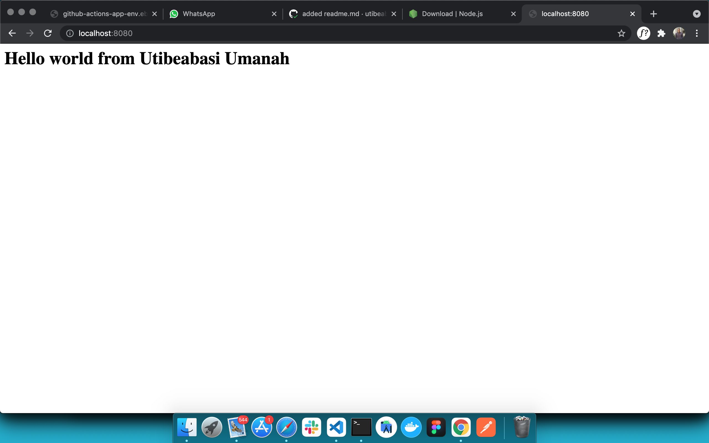

# CI/CD with github actions and Elastic beanstalk






This project aims to demonstrate how to set up a CI/CD pipeline to automatically deploy a simple nodejs app to AWS elastic banstalk

## Installation guide
### **Install git**
[https://git-scm.com/downloads](https://git-scm.com/downloads)

### **Install nodejs**
[https://nodejs.org/en/download/](https://nodejs.org/en/download/)

## Setup
Our local setup here is pretty basic. We just have a basic express web server running on port 8080 that sends `<h1>Hello world from Utibeabasi Umanah</h1>`
to the browser. 






You can run the server by executing
```
    npm start
```

in the project root. This will start up the server on port `8080` and you can view the app by navigating to `http://localhost:8080` in your web browser.

## A look at our pipeline

