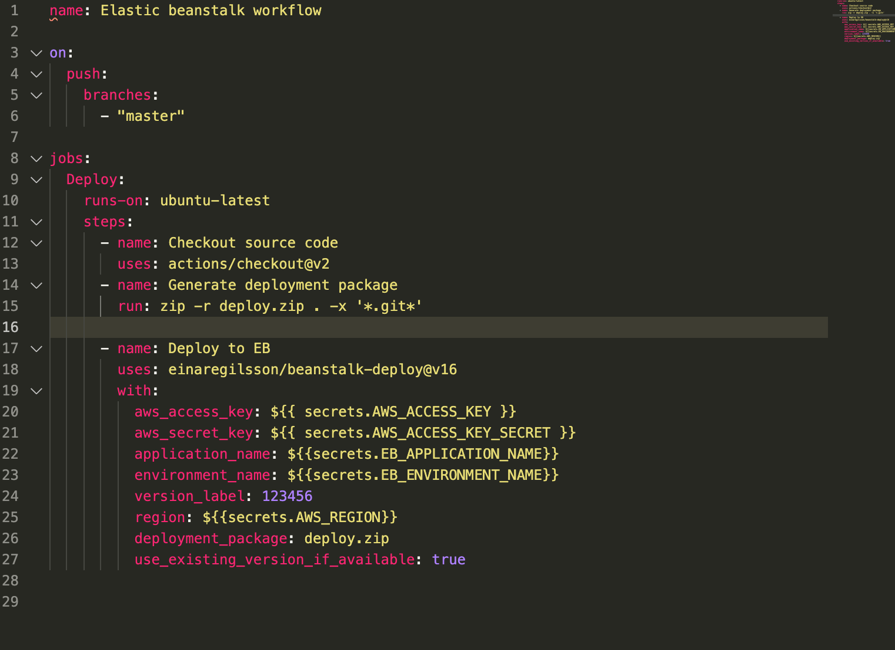
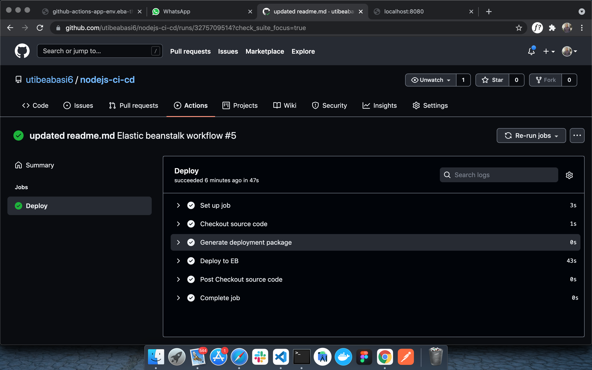
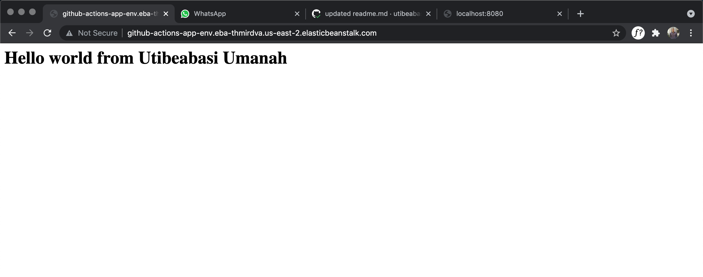

# CI/CD with github actions and Elastic beanstalk

   

This project aims to demonstrate how to set up a CI/CD pipeline to automatically deploy a simple nodejs app to AWS elastic banstalk

## Installation guide
### **Install git**
[https://git-scm.com/downloads](https://git-scm.com/downloads)

### **Install nodejs**
[https://nodejs.org/en/download/](https://nodejs.org/en/download/)

## Setup
Our local setup here is pretty basic. We just have a basic express web server running on port 8080 that sends `<h1>Hello world from Utibeabasi Umanah</h1>`
to the browser. 


You can run the server by executing
```
    npm start
```

in the project root. This will start up the server on port `8080` and you can view the app by navigating to `http://localhost:8080` in your web browser.

## A look at our pipeline
Our pileline is pretty straight forward



It runs whenever a push is made and has the follwing steps:

- Checkout: The source code is checked out
- Zip: The source bundle is zipped with the `zip -r deploy.zip . `. The `-x *.git*` excludes all git files from the zip.
- Deploy: The application is deployed to elastic beanstalk with the beanstalk-deploy action.

> Note: Make sure to add your AWS_ACCESS_KEY, AWS_ACCESS_KEY_SECRET, EB_APPLICATION_NAME(Your elastic beanstalk application name), EB_ENVIRONMENT_NAME(Your elastic beanstalk environment name), and your AWS_REGION to your repository secret.

Finally, push to github and watch the pipeline execute



Navigate to your elastic beanstalk url to view the running app.



And there you have it. We have succesfully implemented a CI/CD pipeline with github actions to push to elastic beanstalk.

## Contact me

Need a devops or SRE engineer to join your team? Send me an email at [utibeabasiumanah6@gmail.com](utibeabasiumanah6@gmail.com)